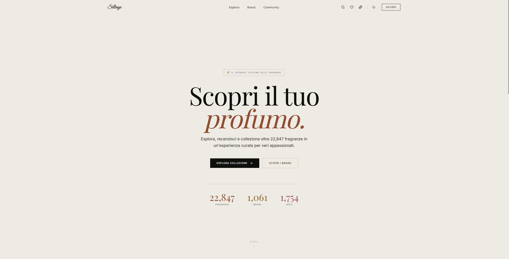
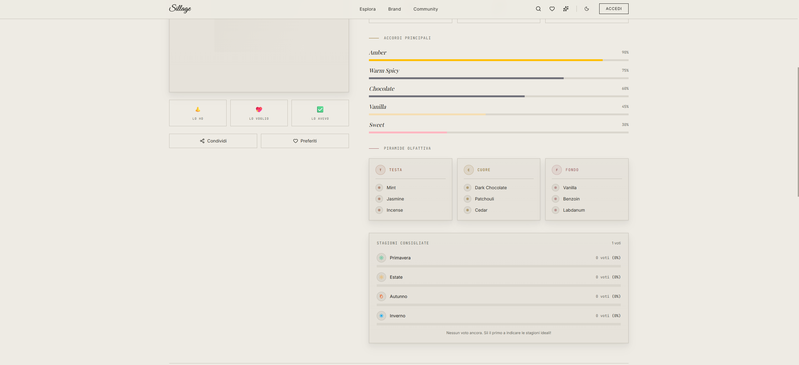

# 🚀 Sillage

[](https://opensource.org/licenses/MIT)
[](https://nextjs.org/)
[](https://www.typescriptlang.org/)
[](https://tailwindcss.com/)
[](https://orm.drizzle.team/)
[](https://supabase.com/)

> **The premium digital experience for artistic perfumery exploration and collection.**  
> Discover, review, and curate your olfactory journey with AI-powered insights and a glassmorphic design.

---

## ✨ Features / Highlights

- 🌸 **Olfactory Mapping**: Advanced search by notes, brands, and accords to discover your perfect scent.
- 🤖 **AI-Powered Moderation**: Intelligent content safety for community reviews using **Google Gemini 2.5 Flash**.
- 💎 **Glassmorphic UI**: A stunning, modern interface built with **Tailwind CSS v4** and **Motion** for fluid micro-interactions.
- ⚡ **High Performance**: Powered by **Next.js 16 Server Actions**, **Drizzle ORM**, and **Upstash Redis** for lightning-fast caching and rate limiting.
- 🔐 **Secure Authentication**: Robust user management via **Supabase Auth**.
- 🛡️ **Reliability**: Integrated rate limiting and input validation with **Zod** to ensure stability.

## 🌐 Live Demo

[**Visit Sillage Live**](https://sillage-dev.vercel.app/)  
*(Note: If the link is not yet active, the project is currently in local development)*

## 🛠️ Tech Stack

| Category | Technology | Version |
|----------|------------|---------|
| **Frontend** | Next.js (App Router) | v16.1.3 |
| **Language** | TypeScript | v5.9 |
| **Styling** | Tailwind CSS | v4.1 |
| **Animation** | Motion (Framer) | v12.27 |
| **Database** | PostgreSQL (Supabase) | Latest |
| **ORM** | Drizzle ORM | v0.45 |
| **State/API** | React Server Actions | - |
| **AI Model** | Google Gemini | 2.5 Flash |
| **Cache/Rate** | Upstash Redis | - |

## 📸 Screenshots


*The immersive landing page with featured fragrances.*


*Detailed fragrance analysis with olfactory pyramid and community stats.*

## 📋 Prerequisites

Before you begin, ensure you have the following installed:

- **Node.js**: v20.x or higher
- **Package Manager**: pnpm (recommended) or npm/yarn
- **Supabase Account**: For the PostgreSQL database and Authentication
- **Upstash Account**: For Redis (Rate Limiting)
- **Google AI Studio Key**: For Gemini API

## 🚀 Installation & Local Setup

Follow these steps to get Sillage running on your local machine:

### 1. Clone the repository
```bash
git clone https://github.com/nicco6598/sillage.git
cd sillage
```

### 2. Install dependencies
```bash
pnpm install
```

### 3. Environment Configuration
Create a `.env.local` file in the root directory and add your credentials:

```bash
# Supabase
NEXT_PUBLIC_SUPABASE_URL=your_supabase_url
NEXT_PUBLIC_SUPABASE_ANON_KEY=your_supabase_anon_key

# Database (Transaction Mode)
DATABASE_URL=postgresql://postgres:[PASSWORD]@[HOST]:[PORT]/postgres

# Google Gemini AI
GOOGLE_API_KEY=your_gemini_api_key

# Upstash Redis
UPSTASH_REDIS_REST_URL=your_upstash_url
UPSTASH_REDIS_REST_TOKEN=your_upstash_token
```

### 4. Database Setup
Push the schema to your Supabase instance:

```bash
pnpm drizzle-kit push
```

### 5. Run Development Server
```bash
pnpm dev
```
Open [http://localhost:3000](http://localhost:3000) with your browser to see the result.

## 📖 Usage

- **Explore**: Navigate to `/explore` to filter fragrances by season, gender, or notes.
- **Review**: Log in to leave reviews on fragrances. Your content will be automatically checked for safety by AI.
- **Collection**: Add perfumes to your "Owned", "Wishlist", or "Tested" lists.
- **Profile**: Manage your preferences and view your contribution stats.

## 📂 Project Structure

```bash
sillage/
├── src/
│   ├── app/                 # Next.js App Router pages & layouts
│   │   ├── actions/         # Server Actions (Business Logic)
│   │   ├── api/             # API Routes (Edge/Serverless)
│   │   ├── fragrance/       # Fragrance-specific pages
│   │   └── ...
│   ├── components/          # React Components
│   │   ├── features/        # Feature-specific components
│   │   ├── ui/              # Reusable UI elements (Buttons, Inputs)
│   │   └── ...
│   ├── lib/                 # Utilities, DB config, AI helpers
│   │   ├── db.ts            # Drizzle setup
│   │   ├── moderation.ts    # Gemini AI integration
│   │   └── supabase/        # Supabase client
│   └── types/               # TypeScript definitions
├── public/                  # Static assets
└── drizzle.config.ts        # Drizzle Kit configuration
```

## 🔮 Roadmap: Web3 Integration (Upcoming)

While currently a robust Web2 platform, Sillage is architected for a Web3 future:

- [ ] **NFT Ownership**: Mint your rare perfume collection as NFTs.
- [ ] **On-Chain Reviews**: Immutable, censorship-resistant reviews on Arbitrum/Base.
- [ ] **Token Rewards**: Earn $SILLAGE tokens for high-quality contributions.

## 🤝 Contributing

Contributions are welcome! Please check out the [issues](https://github.com/your-username/sillage/issues) page.

1. Fork the project
2. Create your feature branch (`git checkout -b feature/AmazingFeature`)
3. Commit your changes (`git commit -m 'Add some AmazingFeature'`)
4. Push to the branch (`git push origin feature/AmazingFeature`)
5. Open a Pull Request

## 📄 License

Distributed under the MIT License. See `LICENSE` for more information.

## 📞 Contact

**Marco** - Senior Full-Stack & Web3 Developer  
Made with ❤️ in Milano 🇮🇹

[LinkedIn](https://www.linkedin.com/in/marconiccolini-/) • [Portfolio](https://mn-portfolio-orpin.vercel.app/) • [GitHub](https://github.com/nicco6598)

---

<p align="center">
  <sub>If you like this project, please give it a star! 🌟</sub>
</p>
